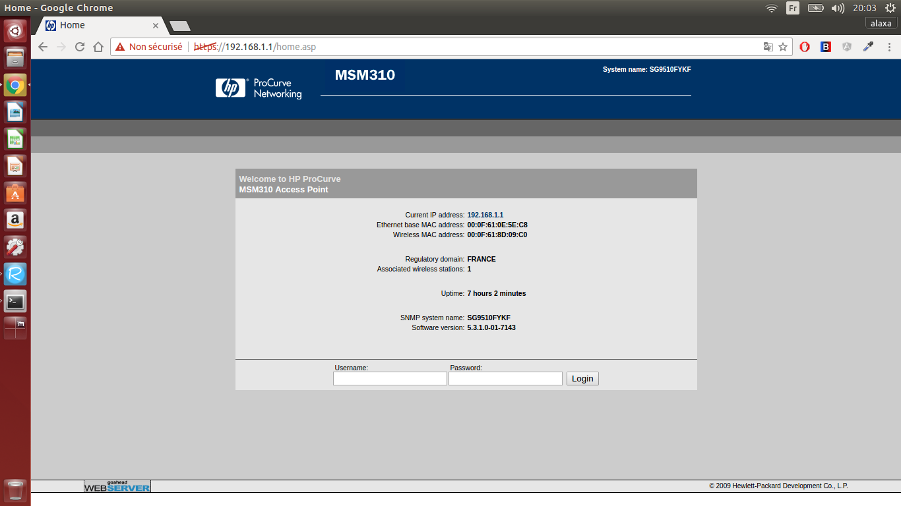
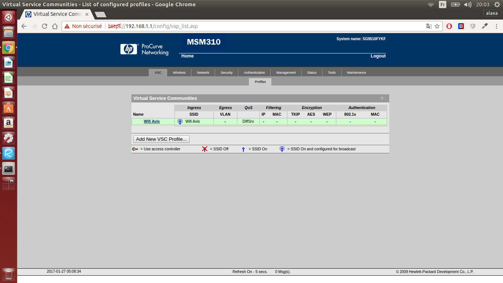
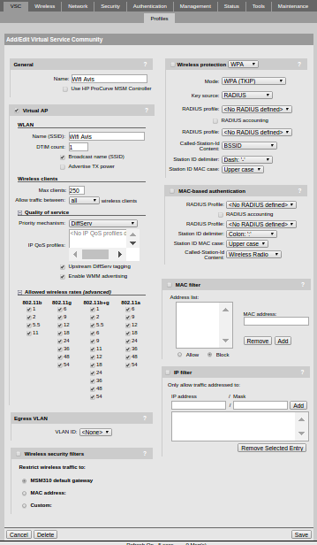
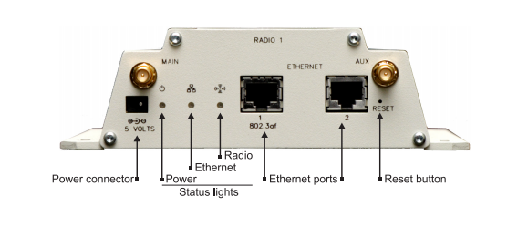
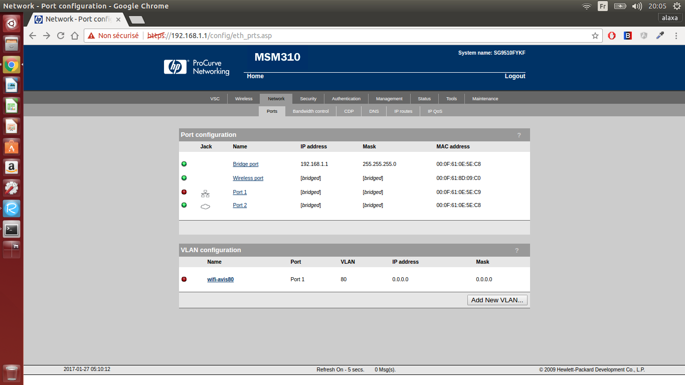
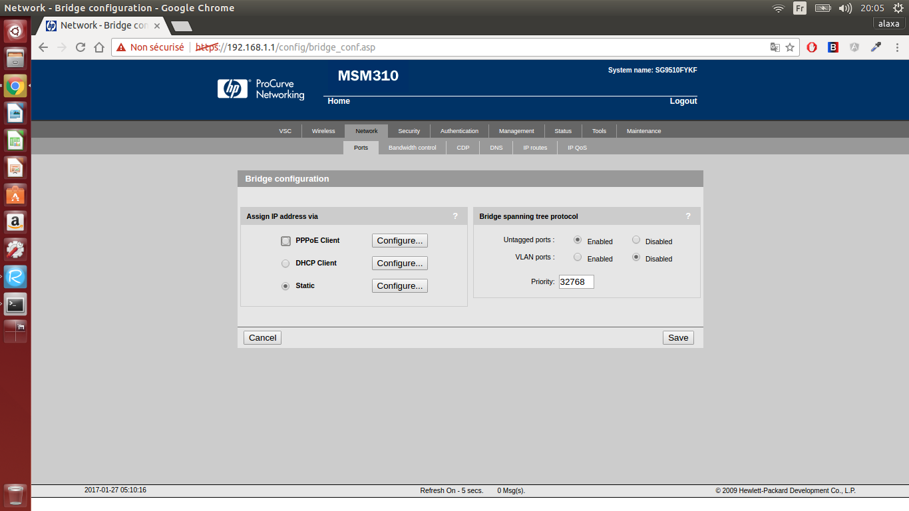

#Wifi Avis
##Introduction

##HP ProCurve Configuration
When you are all wired up, you load the gateway page. If you didn't change the default settings, you should be at [https://192.168.1.1/home.asp](https://192.168.1.1/home.asp). Now if you decide to login you should refer to the [HP Pro Curve quick start guide](http://h20565.www2.hpe.com/hpsc/doc/public/display?sp4ts.oid=3836387&docId=emr_na-c02566509) HP Pro Curve quick start guide in which you will find the default admin credentials:
Username: admin
Password: admin
 

###VSC Configuration
After you logged in, go to the VSC page. Here remove the default VSC which should be **HP Procurve** and create a new one. For the purpose of this study we called it **Wifi Avis**.

In the configuration page remove all forms of authentifications, allow every type of wifi standards to connect and finally set a max clients variables that fits your needs.
You have IPs in range **1-254** you leave **1** for the gateway **2** for the admin computer it leaves us with a **3-254** range. It give 254-3+1=**252** IPs available. This number is important as we will see later in the DHCP server configuration.

###Port configuration

As shown above the back of the MSM 310 Controller.
- Ethernet **Port 1** is used to power the MSM 310 Controller via PoE Injector. If we want to connect the network to the internet we would just have to plug an ethernet cable connected to the internet on the DATA IN port of the PoE Injector (refer  to the picture below).
- Ethernet **Port 2** is used to put admin computer on the VSC Network we created. By the way we could have worked with a wireless admin computer. But to avoid any type of errors we decided to leave it wired.

The **Bridge Port** needs to be configured to fit our needs. 

In **Bridge Port** configuration select a **static IP** address

Configure the **Bridge Port** as follows

###Radio configuration

##Master's Machine Configuration

