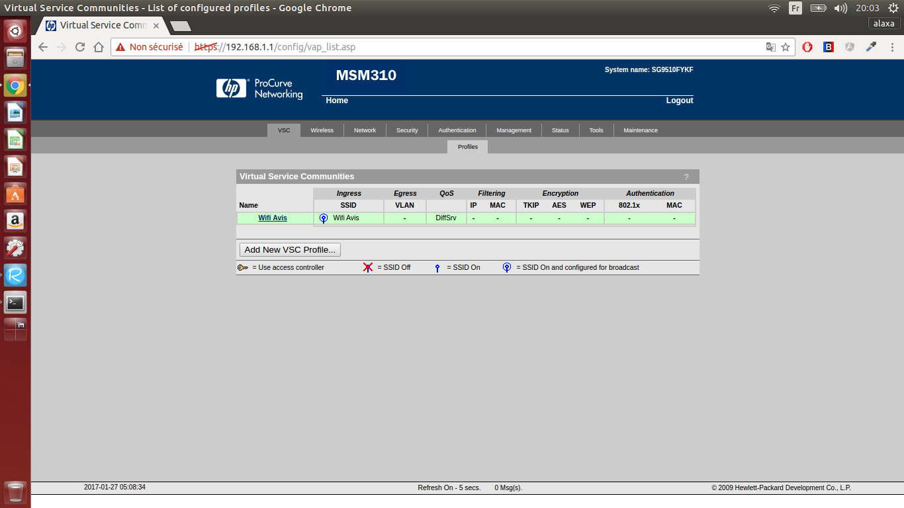
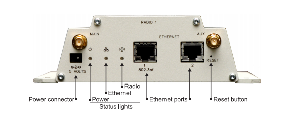
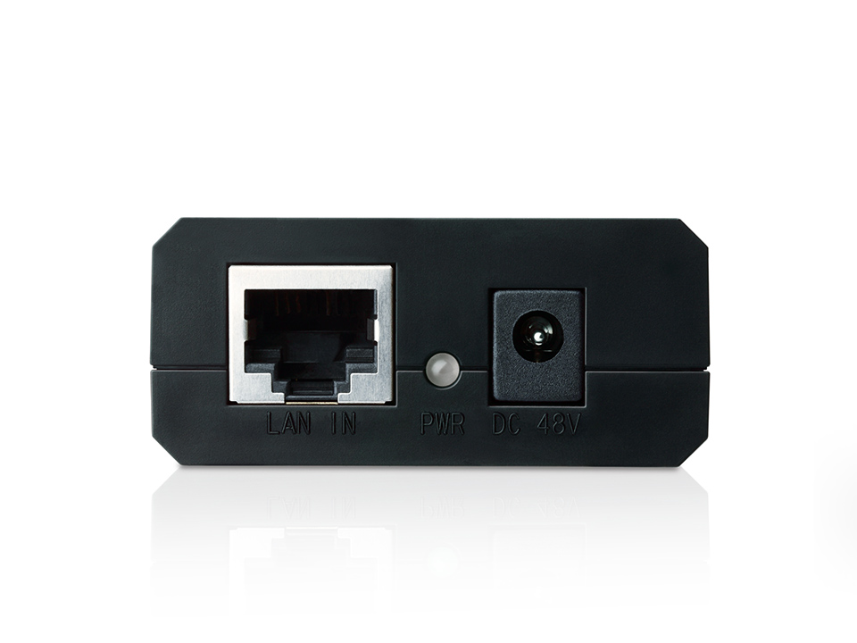
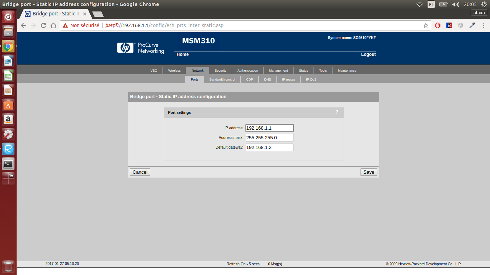
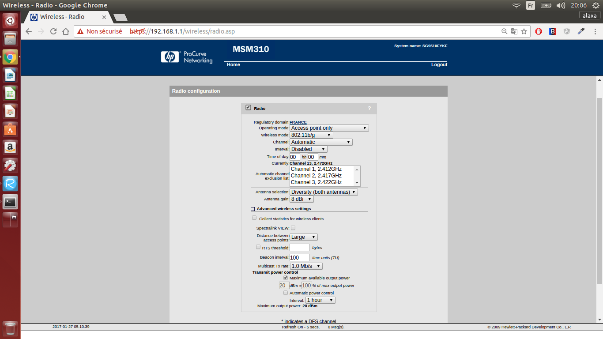
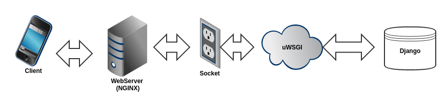

#Wifi Avis
##Introduction

##HP ProCurve Configuration

###Prerequisites:
- 2 RJ45
- 1 TP LINK PoE Injector
- 1 HP ProCurve MSM310 Controller
- 1 Computer with Ubuntu or Debian installed

###Cables
First 1 RJ45 cable linking ***Data OUT + Power*** port from PoE and ***Port 1*** of the controller.
The second cable links ***Port 2*** of the controller and an ***ethernet port*** of your computer.

*In the case where you have multiple ethernet interfaces put the cable in eth0 interface or change eth0 to whatever is your interface's name in the scripts and configuration files.*

###Login

When you are all wired up, you load the gateway page. If you didn't change the default settings, you should be at [https://192.168.1.1/home.asp](https://192.168.1.1/home.asp). Now if you decide to login you should refer to the [HP Pro Curve quick start guide](http://h20565.www2.hpe.com/hpsc/doc/public/display?sp4ts.oid=3836387&docId=emr_na-c02566509) HP Pro Curve quick start guide in which you will find the default admin credentials:
Username: admin
Password: admin
 

###VSC Configuration
After you logged in, go to the VSC page. Here remove the default VSC which should be **HP Procurve** and create a new one. For the purpose of this study we called it **Wifi Avis**.

In the configuration page remove all forms of authentifications, allow every type of wifi standards to connect and finally set a max clients variables that fits your needs.
You have IPs in range **1-254** you leave **1** for the gateway **2** for the admin computer it leaves us with a **3-254** range. It give 254-3+1=**252** IPs available. This number is important as we will see later in the DHCP server configuration.

###Port configuration

As shown above the back of the MSM 310 Controller.
- Ethernet **Port 1** is used to power the MSM 310 Controller via PoE Injector. If we want to connect the network to the internet we would just have to plug an ethernet cable connected to the internet on the DATA IN port of the PoE Injector (refer  to the picture below).
- Ethernet **Port 2** is used to put admin computer on the VSC Network we created. By the way we could have worked with a wireless admin computer. But to avoid any type of errors we decided to leave it wired.

The **Bridge Port** needs to be configured to fit our needs. 

In **Bridge Port** configuration select a **static IP** address

Configure the **Bridge Port** as follows

###Radio configuration

##Master's Machine Configuration
The machine's configuration consists of three steps:

1. DHCP Server
2. DNS
3. WebServer

All these three configuration steps are take care of by the installation script:

###DHCP Server
When a client connects to a network he needs to know the exact configuration it needs to work properly. It's not acceptable knowing the myriad of configurations possible out there. The Dynamic Host Protocol Configuration comes in rescue by leasing all potential clients an IP address with the appropriate configuration.

To do so we started using DHCPd but it was innapropriate. In fact the network we are working with is small so we are using a common tool for both DHCP and DNS: **DNSmasq**.
###DNS
When you query an URL in your favorite web browser the Operating System ask your DNS what is the IP of this given URL. Usually the ISP offers a DNS for you to browse the internet. Here we need to bypass all available DNSs. In fact we needed a Captive Portal. The goal is to have a DNS that replies **192.168.1.2**(IP of master's machine) to every requests except if the query is **192.168.1.1**(IP of the HP ProCurve).
###WebServer
The webserver basically listen to a given port and respond to resquests by sending packets that are able to transit through network and be readable by the wanted protocol client.
The system created for this study is written in Python, therefore a classic server such as Apache or NGINX is not enough. We also need a way to interpret Python, for this purpose we are using uWSGI.
Basically it looks like that:

